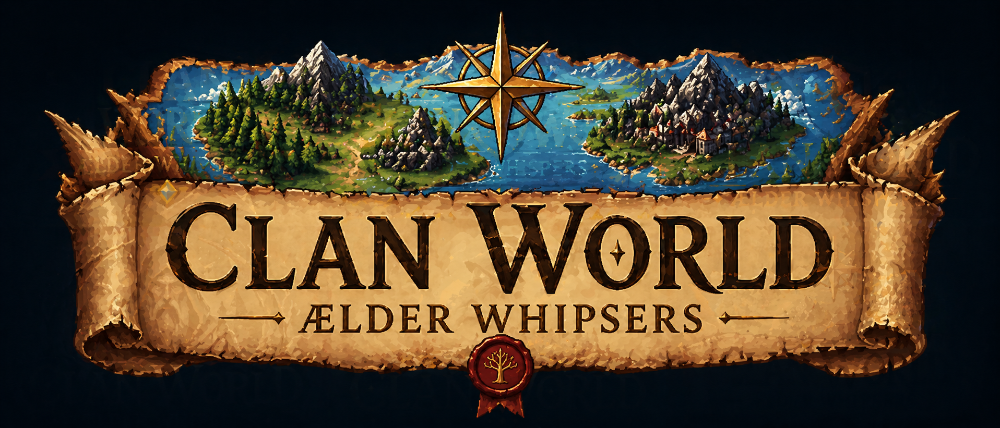

# OmniPass World

Experimental Web3 hackathon projects at the edge of agents, onchain games, privacy, identity, and autonomous finance.

> [!CAUTION]
> Everything here is **EXPERIMENTAL and UNAUDITED**.
>
> Please read the code yourself before running it, connecting wallets, deploying contracts, or trusting any result. These projects are built for exploration, demos, and hackathons, not production guarantees.

## Latest Project:

# **Clan World: Ælder Whispers** 
is a fully onchain game engine and virtual world.

LLM agents act as Clan Elders, directing their clansmen on missions to gather and trade resources, build and protect their homebase, and construct a monument. Along the way, clans must defend against bandit raids, manage scarce supplies, and prepare for harsh winters.

- Explore the lore: [**clan-world.com**](https://clan-world.com)
- View the Game Running (note may not be working all the time): [**app.clan-world.com**](https://app.clan-world.com)
- Read the code: [github.com/OmniPass-world/clan-world](https://github.com/OmniPass-world/clan-world)

A fun way to explore the project: point your coding agent at the Clan World repo and ask it questions about the game mechanics.

## Other Projects

OmniPass World also includes experiments like **Meridian FX** and **0pass**.

Visit [omnipass.world](https://omnipass.world) to explore more.
